# IdentityForge — Product Requirements Document (PRD)
### Financial Customer 360 & Next-Best-Opportunity Engine
**Version:** 3.0 | **Date:** August 2026 | **Team:** Skill-Issue | **PS-04**

---

## Table of Contents
1. [Executive Summary](#1-executive-summary)
2. [Product Vision & Goals](#2-product-vision--goals)
3. [User Personas & Stories](#3-user-personas--stories)
4. [System Architecture](#4-system-architecture)
5. [Data Pipeline & Workflows](#5-data-pipeline--workflows)
6. [Data Model](#6-data-model)
7. [API Specification](#7-api-specification)
8. [Security Architecture](#8-security-architecture)
9. [Frontend Information Architecture](#9-frontend-information-architecture)
10. [Business Rules Engine (BRE)](#10-business-rules-engine-bre)
11. [AI/RAG Integration](#11-airag-integration)
12. [Edge Cases & Robustness](#12-edge-cases--robustness)
13. [Scalability Strategy](#13-scalability-strategy)
14. [Non-Functional Requirements](#14-non-functional-requirements)

---

## 1. Executive Summary

### The Problem
A diversified financial-services organization operates 5 siloed systems: **Equity**, **Mutual Funds**, **Insurance**, **Loans**, and **Wealth Management**. The same customer — say "Rajesh Kumar Sharma" — may exist as 3 different entries:

| System | Name | PAN | Mobile | Email |
|---|---|---|---|---|
| Equity | Rajesh K Sharma | ABCDE1234F | 9876543210 | rajesh@gmail.com |
| MF | R.K. Sharma | ABCDE1234F | — | rk.sharma@yahoo.com |
| Insurance | Rajesh Kumar Sharma | — | 9876543210 | rajesh@gmail.com |

Without unification, the organization:
- Cannot see total relationship value (₹5.2L across systems)
- Cannot identify cross-sell opportunities (Rajesh has no insurance despite ₹5L in investments)
- Cannot provide personalized service (3 RMs may call the same person)

### The Solution: IdentityForge
A **Customer 360 platform** that:
1. **Stitches identities** across siloed systems using a 3-phase resolution engine (deterministic + probabilistic + AI-semantic)
2. **Creates golden records** with survivorship rules, conflict detection, and version history
3. **Generates explainable cross-sell opportunities** with configurable rules and RAG-powered reasoning
4. **Provides role-based dashboards** for RMs (customer view), Managers (team oversight), and Admins (system configuration)

### Key Differentiators
- **Not a JOIN, not a wrapper** — Algorithmic graph-based entity resolution augmented by AI
- **Interactive Identity Graph** — D3.js force-directed visualization of customer clusters
- **Confidence Waterfall** — Visual breakdown of how match scores are computed
- **What-If Simulator** — Preview impact of rule changes before applying
- **RAG Explainability** — Human-readable justifications powered by open-weight LLMs

---

## 2. Product Vision & Goals

### Vision Statement
> *Enable financial institutions to see every customer as ONE person, across every product, and intelligently recommend the next best action — with full transparency and configurability.*

### Business Goals

| Goal | Metric | Target |
|---|---|---|
| Identity Unification | % of duplicate records resolved | >90% of synthetic dataset |
| Cross-sell Revenue | Opportunities generated per 100 customers | >25 actionable opportunities |
| RM Productivity | Time to view unified customer profile | <3 seconds |
| Data Quality | % of conflicts detected and flagged | 100% of synthetic conflicts |
| Configurability | Time to change a business rule and see impact | <30 seconds (live demo) |

### Success Criteria (Mapped to Rubric)

| Rubric Criterion | Weight | Our Approach | Demo Proof |
|---|---|---|---|
| Approach & System Design | 12% | Graph-based entity resolution, industry MDM architecture | Architecture walkthrough |
| Architecture & Code Quality | 13% | Layered (Router→Service→Engine→Repo), event pipeline | Code walkthrough |
| Programming & Code Quality | 13% | Typed Python, async, modular, tested, documented | Live code inspection |
| Configurability | 12% | Centralized BRE, What-If simulator, before/after preview | Live rule change |
| Backend & Data Design | 10% | Supabase PostgreSQL + pgvector, normalized schema, JSONB provenance | Schema walkthrough |
| UI/UX | 8% | Enterprise dark theme, D3 graph, waterfall charts, dense data grids | Visual demo |
| Robustness & Edge Cases | 8% | Missing data, duplicates, conflicts, bad input, graceful errors | Feed bad data live |
| Scalability | 7% | Blocking (O(n×b)), vector index, Redis cache, async pipeline | Explain with math |
| Innovation | 7% | RAG explainability, semantic matching, NL queries, What-If simulator | Demo all 4 |
| Security & Data Protection | 10% | RBAC, data scoping, masking, audit trail, env secrets | Unauthorized access test |

---

## 3. User Personas & Stories

### Persona 1: Priya — Relationship Manager (RM)

| Attribute | Detail |
|---|---|
| **Role** | RM — manages 40 customer relationships |
| **Goal** | Find the best cross-sell opportunities in her portfolio |
| **Pain Point** | Has to log into 5 systems to understand one customer |
| **What she needs** | A single unified view of each customer, prioritized opportunity list |

**User Stories:**
| ID | Story | Acceptance Criteria |
|---|---|---|
| RM-01 | As an RM, I want to see a unified Customer 360 profile so I can understand a customer's full relationship | Golden record shows all products, total value, source lineage |
| RM-02 | As an RM, I want to see why records were matched so I can trust the unification | Confidence score + waterfall breakdown + AI explanation visible |
| RM-03 | As an RM, I want a prioritized list of cross-sell opportunities with reasoning | Opportunities sorted by score, each with explainable reasoning |
| RM-04 | As an RM, I can ONLY see my assigned customers, not another RM's | API returns 403 for unassigned customer IDs |
| RM-05 | As an RM, I see masked PAN/mobile/email (not full values) | PAN shows as `ABCDE****F`, mobile as `******3210` |
| RM-06 | As an RM, I want to mark opportunities as Assigned/Converted/Dismissed | Status update persists, reflected in dashboard counts |

---

### Persona 2: Sanjay — Manager

| Attribute | Detail |
|---|---|
| **Role** | Manager — oversees 3 RMs and their combined portfolio |
| **Goal** | Monitor team performance and resolve data conflicts |
| **Pain Point** | Can't see which RMs have the best opportunities or which conflicts need review |
| **What he needs** | Team dashboard, review queue, aggregated opportunity pipeline |

**User Stories:**
| ID | Story | Acceptance Criteria |
|---|---|---|
| MGR-01 | As a Manager, I want to see all customers across my team of RMs | Customer list scoped to team, not all org customers |
| MGR-02 | As a Manager, I want to review and approve/reject conflicting matches | Review queue shows side-by-side comparison + AI suggestion |
| MGR-03 | As a Manager, I want to see aggregated opportunity pipeline by RM | Dashboard shows per-RM opportunity counts, values, conversion rates |
| MGR-04 | As a Manager, I can see full mobile/email but PAN is still partially masked | Masking rules differ by role |

---

### Persona 3: Amit — Admin

| Attribute | Detail |
|---|---|
| **Role** | Admin — manages system configuration and data ingestion |
| **Goal** | Tune matching rules and opportunity thresholds for business needs |
| **Pain Point** | Any config change in current systems requires a code deployment |
| **What he needs** | Live configuration console, What-If simulator, audit trail |

**User Stories:**
| ID | Story | Acceptance Criteria |
|---|---|---|
| ADM-01 | As an Admin, I want to change match weights and thresholds without code changes | Config console with sliders/inputs, saved to DB, immediate effect |
| ADM-02 | As an Admin, I want to preview the impact of a rule change before applying | What-If simulator shows "+12 new auto-merges" or "+47 new opportunities" |
| ADM-03 | As an Admin, I want all my config changes logged with old/new values | Audit log shows actor, timestamp, old value, new value |
| ADM-04 | As an Admin, I want to ingest new source data (CSV upload) | Upload endpoint validates, standardizes, and triggers matching |
| ADM-05 | As an Admin, I want to see a Data Quality Scorecard | Dashboard shows % missing PAN per source, anomaly counts, alias detections |
| ADM-06 | As an Admin, I can see full unmasked PAN/mobile/email | Admin role has unrestricted data access |

---

### Persona 4: Neha — Credit Approver

| Attribute | Detail |
|---|---|
| **Role** | Credit Approver — reviews loan/credit decisions |
| **Goal** | View complete customer financial history across all products |
| **What she needs** | Read-only access to Customer 360, cannot modify configs or approve merges |

---

## 4. System Architecture

### 4.1 High-Level Architecture

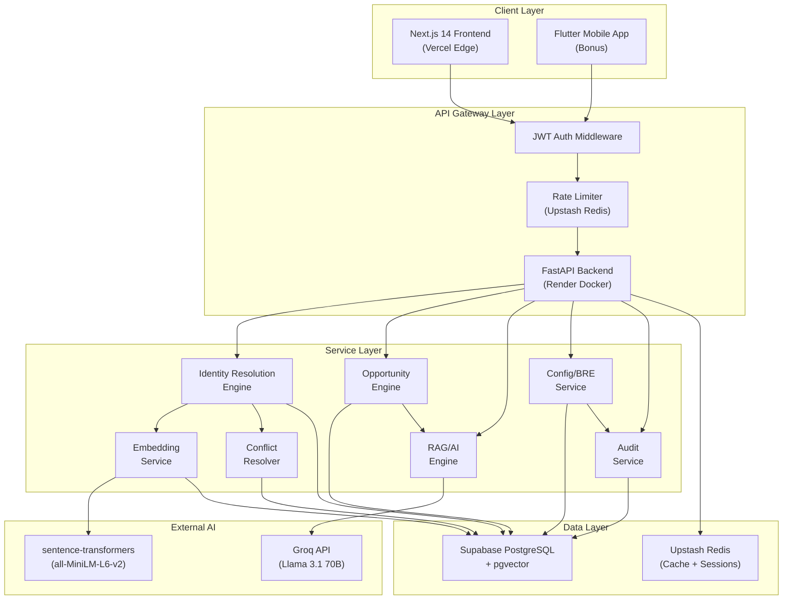

### 4.2 Layered Architecture (Code Organization)

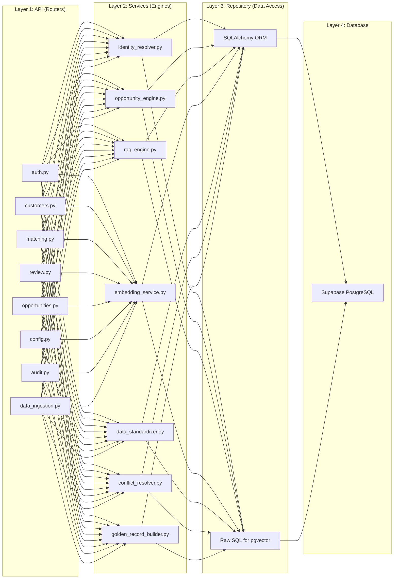

### 4.3 Deployment Architecture

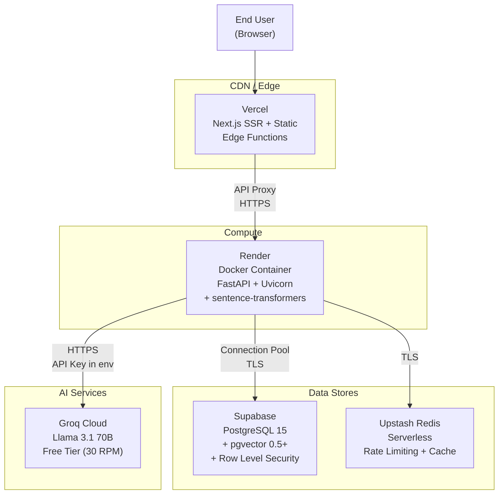

---

## 5. Data Pipeline & Workflows

### 5.1 Master Data Pipeline (End-to-End)

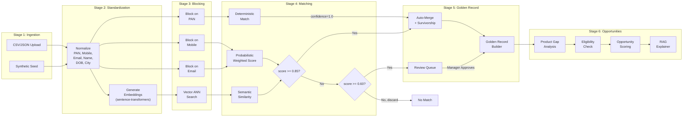

### 5.2 Identity Resolution — Detailed Scoring Algorithm

```
For each candidate pair (record_a, record_b):

Step 1: Compute attribute-level match scores
┌──────────────────┬────────┬──────────────────────────────┬───────────────┐
│ Attribute        │ Weight │ Match Function               │ Score Range   │
├──────────────────┼────────┼──────────────────────────────┼───────────────┤
│ PAN              │ 0.35   │ Exact match after normalize  │ 0.0 or 1.0   │
│ Mobile           │ 0.20   │ Exact match after normalize  │ 0.0 or 1.0   │
│ Email            │ 0.15   │ Exact match after normalize  │ 0.0 or 1.0   │
│ Name (String)    │ 0.12   │ Jaro-Winkler distance        │ 0.0 to 1.0   │
│ Name (Semantic)  │ 0.08   │ Cosine similarity (pgvector) │ 0.0 to 1.0   │
│ DOB              │ 0.05   │ Exact match after normalize  │ 0.0 or 1.0   │
│ City             │ 0.03   │ Exact or alias match         │ 0.0 or 1.0   │
│ Segment          │ 0.02   │ Exact match                  │ 0.0 or 1.0   │
└──────────────────┴────────┴──────────────────────────────┴───────────────┘
Total Weight = 1.00

Step 2: Compute composite confidence score
  confidence = Σ (weight_i × score_i) for all attributes

Step 3: Apply decision thresholds (configurable via BRE)
  confidence >= auto_merge_threshold (0.85)  → AUTO_MERGE
  confidence >= review_threshold (0.60)      → PENDING_REVIEW  
  confidence < review_threshold              → NO_MATCH

Step 4: Graph propagation (transitive closure)
  If A↔B (0.95) and B↔C (0.88), then A↔C exists transitively.
  Cluster {A, B, C} → single golden record.
  Cluster confidence = min(edge confidences in spanning tree).
```

### 5.3 Conflict Resolution Workflow

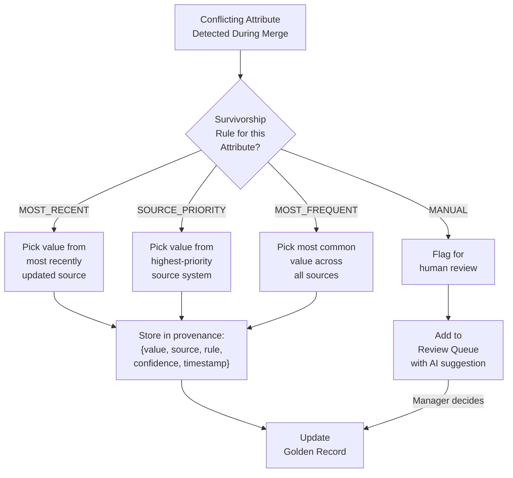

### 5.4 Opportunity Generation Workflow

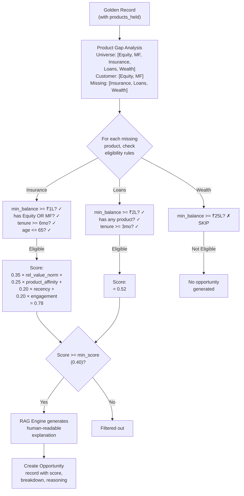

### 5.5 Authentication & Authorization Flow

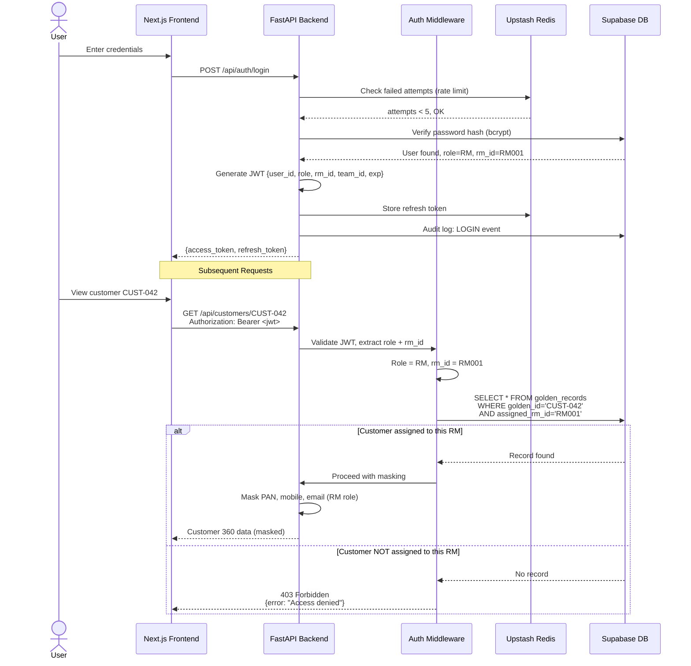

### 5.6 Config Change & What-If Workflow

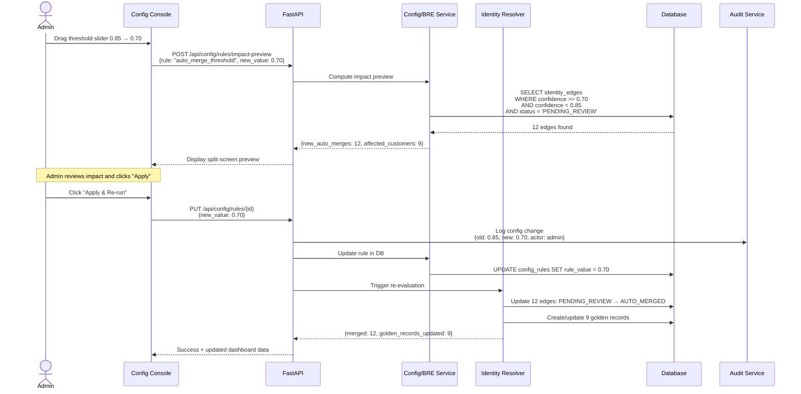

---

## 6. Data Model

### 6.1 Entity Relationship Diagram

```mermaid
erDiagram
    USERS {
        uuid id PK
        string username UK
        string email
        string password_hash
        enum role "RM | MANAGER | ADMIN | CREDIT_APPROVER"
        string rm_id
        string team_id
        boolean is_active
        int failed_login_attempts
        datetime locked_until
        datetime created_at
    }

    SOURCE_RECORDS {
        uuid id PK
        enum source_system "EQUITY | MF | INSURANCE | LOANS | WEALTH"
        string source_customer_id
        string pan_id "encrypted, nullable"
        string mobile "nullable"
        string email "nullable"
        string name
        date dob "nullable"
        string city "nullable"
        string segment "nullable"
        string product_type
        decimal balance_aum
        decimal relationship_value
        date last_activity_date
        string rm_id "nullable"
        jsonb raw_data
        vector name_embedding "384 dimensions"
        string normalized_name
        string normalized_mobile
        string normalized_email
        datetime created_at
    }

    GOLDEN_RECORDS {
        uuid golden_id PK
        string canonical_name
        string canonical_pan "encrypted"
        string canonical_mobile
        string canonical_email
        date canonical_dob
        string canonical_city
        string canonical_segment
        decimal total_relationship_value
        jsonb products_held "array of product details"
        jsonb source_record_ids "array of UUIDs"
        jsonb attribute_provenance "per-field: value, source, rule"
        float match_confidence
        int version
        enum status "ACTIVE | UNDER_REVIEW | MERGED_INTO"
        uuid merged_into_id FK "nullable"
        string assigned_rm_id
        datetime created_at
        datetime updated_at
    }

    IDENTITY_EDGES {
        uuid id PK
        uuid source_a_id FK
        uuid source_b_id FK
        uuid golden_id FK "nullable"
        enum match_type "DETERMINISTIC | PROBABILISTIC | SEMANTIC | MANUAL"
        float confidence_score
        jsonb match_reasons "per-attribute scores"
        string ai_explanation "nullable"
        enum status "AUTO_MERGED | PENDING_REVIEW | REJECTED | MANUAL_MERGED"
        datetime created_at
    }

    OPPORTUNITIES {
        uuid id PK
        uuid golden_id FK
        enum opportunity_type "CROSS_SELL | UPSELL | RETENTION | PROTECTION"
        string product_recommended
        float score
        jsonb score_breakdown
        string ai_reasoning
        decimal potential_value
        jsonb eligibility_met
        enum status "NEW | VIEWED | ASSIGNED | IN_PROGRESS | CONVERTED | DISMISSED"
        string assigned_rm_id
        datetime created_at
        datetime updated_at
    }

    CONFIG_RULES {
        uuid id PK
        enum category "MATCHING_WEIGHTS | THRESHOLDS | OPPORTUNITY_RULES | NORMALIZATION | SOURCE_PRECEDENCE | SCORING_WEIGHTS"
        string rule_key UK
        jsonb rule_value
        string description
        boolean is_active
        int version
        uuid updated_by FK
        datetime updated_at
    }

    AUDIT_LOGS {
        uuid id PK
        uuid actor_id FK
        string actor_username
        string actor_role
        enum action "LOGIN | CONFIG_CHANGE | MERGE_APPROVE | MERGE_REJECT | MANUAL_MERGE | UNMERGE | OPPORTUNITY_UPDATE | DATA_INGEST | MATCHING_RUN"
        string entity_type
        string entity_id
        jsonb old_value "nullable"
        jsonb new_value "nullable"
        string ip_address
        datetime timestamp
    }

    REVIEW_QUEUE {
        uuid id PK
        enum review_type "LOW_CONFIDENCE_MATCH | ATTRIBUTE_CONFLICT | DUPLICATE_SUSPECT | AI_FLAGGED"
        uuid golden_id FK "nullable"
        jsonb source_record_ids
        jsonb details
        string ai_suggestion "nullable"
        enum priority "LOW | MEDIUM | HIGH | CRITICAL"
        uuid assigned_to FK "nullable"
        enum status "PENDING | IN_REVIEW | APPROVED | REJECTED"
        uuid resolved_by FK "nullable"
        string resolution_notes "nullable"
        datetime created_at
        datetime resolved_at "nullable"
    }

    USERS ||--o{ AUDIT_LOGS : "performs"
    USERS ||--o{ CONFIG_RULES : "modifies"
    USERS ||--o{ REVIEW_QUEUE : "resolves"
    SOURCE_RECORDS ||--o{ IDENTITY_EDGES : "source_a"
    SOURCE_RECORDS ||--o{ IDENTITY_EDGES : "source_b"
    GOLDEN_RECORDS ||--o{ IDENTITY_EDGES : "belongs_to"
    GOLDEN_RECORDS ||--o{ OPPORTUNITIES : "has"
    GOLDEN_RECORDS ||--o{ REVIEW_QUEUE : "flagged_for"
```

---

## 7. API Specification

### 7.1 Authentication

| Method | Endpoint | Auth | Description | Rate Limit |
|---|---|---|---|---|
| POST | `/api/auth/login` | Public | Login → JWT tokens | 5 attempts/15min |
| POST | `/api/auth/refresh` | Public | Rotate refresh token | 10/min |
| GET | `/api/auth/me` | Any | Current user profile | 60/min |
| POST | `/api/auth/logout` | Any | Invalidate session | 10/min |

### 7.2 Customers

| Method | Endpoint | Auth | Data Scoping | Description |
|---|---|---|---|---|
| GET | `/api/customers` | RM+ | RM=own, Mgr=team, Admin=all | List golden records |
| GET | `/api/customers/{id}` | RM+ | Same | Customer 360 with lineage |
| GET | `/api/customers/{id}/graph` | RM+ | Same | Identity graph data (D3) |
| GET | `/api/customers/{id}/waterfall` | RM+ | Same | Confidence waterfall data |
| GET | `/api/customers/{id}/summary` | RM+ | Same | AI-generated summary |
| GET | `/api/customers/search` | RM+ | Scoped | Search by name/PAN/mobile |
| POST | `/api/customers/nl-query` | Manager+ | Scoped | Natural language query |

### 7.3 Identity Matching

| Method | Endpoint | Auth | Description |
|---|---|---|---|
| POST | `/api/matching/run` | Admin | Trigger full identity resolution |
| POST | `/api/matching/run-incremental` | Admin | Resolve a single new record |
| GET | `/api/matching/results` | Manager+ | View match results |
| GET | `/api/matching/stats` | Manager+ | Match statistics (for Data Quality dashboard) |

### 7.4 Review Queue

| Method | Endpoint | Auth | Description |
|---|---|---|---|
| GET | `/api/review/queue` | Manager+ | List pending reviews |
| GET | `/api/review/{id}` | Manager+ | Review item with AI suggestion |
| POST | `/api/review/{id}/approve` | Manager+ | Approve merge |
| POST | `/api/review/{id}/reject` | Manager+ | Reject merge |
| POST | `/api/review/{id}/manual-merge` | Admin | Manual merge with custom field selection |
| POST | `/api/review/unmerge/{golden_id}` | Admin | Unmerge a golden record |

### 7.5 Opportunities

| Method | Endpoint | Auth | Description |
|---|---|---|---|
| GET | `/api/opportunities` | RM+ | List opportunities (scoped) |
| GET | `/api/opportunities/dashboard` | Manager+ | Aggregated dashboard |
| GET | `/api/opportunities/{id}` | RM+ | Detail with AI reasoning |
| PATCH | `/api/opportunities/{id}/status` | RM+ | Update status |
| POST | `/api/opportunities/generate` | Admin | Re-generate all opportunities |

### 7.6 Configuration (BRE)

| Method | Endpoint | Auth | Description |
|---|---|---|---|
| GET | `/api/config/rules` | Admin | List all rules by category |
| GET | `/api/config/rules/{id}` | Admin | Single rule detail |
| PUT | `/api/config/rules/{id}` | Admin | Update rule (audited) |
| GET | `/api/config/rules/{id}/history` | Admin | Version history |
| POST | `/api/config/rules/impact-preview` | Admin | What-If simulator |

### 7.7 Audit

| Method | Endpoint | Auth | Description |
|---|---|---|---|
| GET | `/api/audit/logs` | Admin/Manager | Filtered audit trail |
| GET | `/api/audit/logs/export` | Admin | Export as CSV |

### 7.8 Data Ingestion

| Method | Endpoint | Auth | Description |
|---|---|---|---|
| POST | `/api/ingest/upload` | Admin | Upload CSV/JSON |
| POST | `/api/ingest/seed` | Admin | Seed synthetic data |
| GET | `/api/ingest/quality-report` | Admin | Data quality scorecard |

---

## 8. Security Architecture

### 8.1 RBAC Permission Matrix

| Resource | RM | Manager | Credit Approver | Admin |
|---|---|---|---|---|
| View own customers | ✅ | ✅ | ✅ | ✅ |
| View team customers | ❌ | ✅ | ❌ | ✅ |
| View all customers | ❌ | ❌ | ❌ | ✅ |
| Review queue (view) | ❌ | ✅ | ❌ | ✅ |
| Approve/Reject merge | ❌ | ✅ | ❌ | ✅ |
| Manual merge/unmerge | ❌ | ❌ | ❌ | ✅ |
| Update opportunity status | ✅ | ✅ | ❌ | ✅ |
| View opportunity dashboard | ❌ | ✅ | ❌ | ✅ |
| Change config rules | ❌ | ❌ | ❌ | ✅ |
| View audit logs | ❌ | ✅ (limited) | ❌ | ✅ |
| Ingest data | ❌ | ❌ | ❌ | ✅ |
| Run matching | ❌ | ❌ | ❌ | ✅ |
| NL query | ❌ | ✅ | ❌ | ✅ |

### 8.2 Data Masking by Role

| Data Field | RM | Manager | Credit Approver | Admin |
|---|---|---|---|---|
| PAN | `ABCDE****F` | `ABCDE****F` | `ABCDE****F` | `ABCDE1234F` |
| Mobile | `******3210` | `9876543210` | `******3210` | `9876543210` |
| Email | `ra****@gmail.com` | `rajesh@gmail.com` | `ra****@gmail.com` | `rajesh@gmail.com` |
| Account Numbers | Masked | Masked | Masked | Full |

### 8.3 Security Controls

| Control | Implementation |
|---|---|
| **Password Storage** | bcrypt hash (cost factor 12) |
| **JWT Tokens** | Access (30 min expiry), Refresh (7 day, rotated) |
| **Rate Limiting** | Sliding window via Upstash Redis (5 login attempts / 15 min) |
| **Input Validation** | Pydantic schema validation on all endpoints |
| **SQL Injection** | SQLAlchemy ORM parameterized queries |
| **Secrets Management** | `.env` file, never hardcoded, Render env vars in production |
| **CORS** | Whitelist only Vercel frontend domain |
| **Idempotency** | Idempotency keys for merge/config operations |
| **Error Responses** | Generic error messages, no stack traces in production |
| **Audit Trail** | All privileged actions logged with actor, timestamp, old/new values |
| **TLS** | Enforced on Vercel (edge), Render (HTTPS), Supabase (SSL) |

### 8.4 Auditable Events

| Event | Actor | Logged Data |
|---|---|---|
| LOGIN / LOGOUT | Any | IP, user agent, success/failure |
| CONFIG_CHANGE | Admin | rule_key, old_value, new_value |
| MERGE_APPROVE | Manager | golden_id, source_record_ids, confidence |
| MERGE_REJECT | Manager | golden_id, reason |
| MANUAL_MERGE | Admin | golden_id, selected field values |
| UNMERGE | Admin | golden_id, resulting record IDs |
| DATA_INGEST | Admin | file name, record count, errors |
| MATCHING_RUN | Admin | total records, matches found, duration |
| OPPORTUNITY_UPDATE | RM/Manager | opportunity_id, old_status, new_status |

---

## 9. Frontend Information Architecture

### 9.1 Screen Map

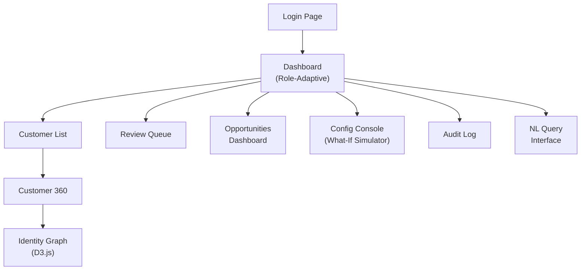

### 9.2 Screen Specifications

#### Screen 1: Login
- Enterprise dark background, organization logo
- Username/password fields with role indicator
- Rate limit feedback ("Account locked for 15 minutes")
- No "Sign up" — this is an internal enterprise tool

#### Screen 2: Dashboard (Role-Adaptive)

**RM View:**
```
┌──────────────────────────────────────────────────────────────┐
│  Welcome, Priya (RM)                                [Logout] │
├──────────┬──────────┬──────────┬──────────────────────────────┤
│ 📊 42    │ 🎯 12    │ 💰 ₹1.8Cr│ 📋 3 Pending                │
│ Customers│ Opps     │ Total AUM│ Reviews                     │
├──────────┴──────────┴──────────┴──────────────────────────────┤
│  TOP OPPORTUNITIES                                           │
│  ┌────────────────────────────────────────────────────────┐  │
│  │ 1. Rajesh Sharma — Insurance Cross-sell — Score: 0.78  │  │
│  │ 2. Meena Patel — Wealth Upsell — Score: 0.71          │  │
│  │ 3. Vikram Singh — Loans — Score: 0.65                  │  │
│  └────────────────────────────────────────────────────────┘  │
│  RECENT MATCHES                                              │
│  ┌────────────────────────────────────────────────────────┐  │
│  │ Rajesh K Sharma (Equity) ↔ R.K. Sharma (MF) — 87%     │  │
│  └────────────────────────────────────────────────────────┘  │
└──────────────────────────────────────────────────────────────┘
```

**Admin View — includes Data Quality Scorecard:**
```
┌──────────────────────────────────────────────────────────────┐
│  DATA QUALITY SCORECARD                                      │
│  ┌──────────┬──────────┬──────────┬──────────┬──────────┐   │
│  │ Equity   │ MF       │ Insurance│ Loans    │ Wealth   │   │
│  │ ████ 92% │ ███░ 78% │ ██░░ 61% │ ███░ 85% │ ████ 95% │   │
│  │ PAN: 95% │ PAN: 70% │ PAN: 45% │ PAN: 90% │ PAN: 98% │   │
│  │ Mob: 90% │ Mob: 85% │ Mob: 80% │ Mob: 82% │ Mob: 92% │   │
│  └──────────┴──────────┴──────────┴──────────┴──────────┘   │
│  Anomalies: 3 city aliases, 12 format inconsistencies        │
│  Total Records: 623 | Golden Records: 248 | Match Rate: 62%  │
└──────────────────────────────────────────────────────────────┘
```

#### Screen 3: Customer 360
- Golden profile header with masked fields
- **Confidence Waterfall** chart (animated bar building up to total score)
- Source Lineage: card per source system with conflict icons (⚠️)
- Products & Holdings: visual tiles with balance per system
- Animated total relationship value counter
- Opportunities section with AI reasoning cards
- "View Identity Graph" button → D3 page

#### Screen 4: Identity Graph (D3.js)
- Force-directed graph
- Node colors: Equity=blue, MF=green, Insurance=red, Loans=amber, Wealth=purple
- Golden node: gold, larger
- Edge thickness = confidence score
- Click node → side panel with details
- Cluster grouping with zoom/pan

#### Screen 5: Config Console
- Tabbed: Matching Weights | Thresholds | Opportunity Rules | Source Precedence
- Slider controls for weights/thresholds
- **Split-screen preview** when a value changes
- "Impact Preview" button → calls API → shows projected changes
- "Apply & Re-run" button → saves + triggers re-evaluation
- Change history timeline below

#### Screen 6: Review Queue
- Data table with columns: Type, Priority, Customers, Confidence, AI Suggestion
- Click row → side-by-side record comparison with diff highlighting
- Approve / Reject / Manual Merge buttons

#### Screen 7: Opportunity Dashboard
- Filterable/sortable opportunity table
- Funnel chart (New → Assigned → In Progress → Converted)
- Manager view: per-RM aggregation

#### Screen 8: Audit Log
- Searchable table with actor, action, entity, timestamp
- Expandable rows showing old/new value JSON diff
- Filter by action type, actor, date range

---

## 10. Business Rules Engine (BRE)

All rules stored in `config_rules` table. Editable via Admin UI. Every change audited.

### 10.1 Default Rule Configuration

```json
{
  "matching_weights": {
    "pan": 0.35,
    "mobile": 0.20,
    "email": 0.15,
    "name_string": 0.12,
    "name_semantic": 0.08,
    "dob": 0.05,
    "city": 0.03,
    "segment": 0.02
  },
  "thresholds": {
    "auto_merge": 0.85,
    "manual_review": 0.60,
    "semantic_similarity_min": 0.90
  },
  "source_precedence": {
    "name": ["WEALTH", "INSURANCE", "EQUITY", "MF", "LOANS"],
    "mobile": "MOST_RECENT",
    "email": "MOST_RECENT",
    "dob": "MOST_FREQUENT",
    "city": ["INSURANCE", "LOANS", "WEALTH", "EQUITY", "MF"],
    "segment": "HIGHEST_VALUE_SOURCE"
  },
  "opportunity_rules": {
    "Insurance": {
      "type": "CROSS_SELL",
      "min_relationship_value": 100000,
      "required_products_any": ["Equity", "MutualFunds"],
      "min_tenure_months": 6,
      "max_age": 65,
      "excluded_segments": ["DORMANT"]
    },
    "WealthManagement": {
      "type": "UPSELL",
      "min_relationship_value": 2500000,
      "required_products_all": ["Equity", "MutualFunds"],
      "min_tenure_months": 12,
      "preferred_segments": ["HNI", "ULTRA_HNI"]
    },
    "Loans": {
      "type": "CROSS_SELL",
      "min_relationship_value": 200000,
      "required_products_any": ["Equity", "MutualFunds", "Insurance"],
      "min_tenure_months": 3
    }
  },
  "scoring_weights": {
    "relationship_value": 0.35,
    "product_affinity": 0.25,
    "recency": 0.20,
    "engagement": 0.20
  },
  "normalization_rules": {
    "city_aliases": {
      "Bombay": "Mumbai",
      "Bangalore": "Bengaluru",
      "Calcutta": "Kolkata",
      "Madras": "Chennai",
      "Poona": "Pune"
    },
    "mobile_strip_prefixes": ["+91", "0"],
    "pan_regex": "^[A-Z]{5}[0-9]{4}[A-Z]$",
    "name_remove_titles": ["Mr", "Mrs", "Ms", "Dr", "Shri", "Smt"]
  }
}
```

---

## 11. AI/RAG Integration

### 11.1 Architecture

| AI Component | Technology | Purpose | Why Not a Wrapper |
|---|---|---|---|
| **Semantic Embeddings** | sentence-transformers (all-MiniLM-L6-v2, 80MB) | Generate 384-dim vectors for customer name+city → pgvector cosine search | Augments algorithmic matching, doesn't replace it |
| **RAG Explainer** | LangChain + Groq (Llama 3.1 70B) | Context-aware explanations of matches and opportunities | Retrieves actual data + rules, not generic responses |
| **NL Query** | Groq (Llama 3.1) | Convert "Show HNI customers without insurance" → structured API params | Converts to deterministic query, AI doesn't make the decision |
| **Conflict Suggester** | Groq (Llama 3.1) | Suggest which conflicting value to keep and why | Suggestion only — human (Manager) makes final decision |

### 11.2 RAG Pipeline

```
User asks: "Why was Rajesh matched across systems?"

Step 1 — RETRIEVE:
  - Fetch identity_edges for Rajesh's golden_id
  - Fetch all source_records in the cluster
  - Fetch active config_rules for matching weights

Step 2 — AUGMENT (build prompt context):
  "Match Data: PAN matched exactly (ABCDE1234F), Email partially matched,
   Name 'Rajesh K Sharma' vs 'R.K. Sharma' scored 0.92 Jaro-Winkler 
   and 0.95 semantic similarity. Active weights: PAN=0.35, Email=0.15..."

Step 3 — GENERATE (Llama 3.1):
  "These records represent the same customer with 87% confidence.
   The primary identifier (PAN ABCDE****F) matched exactly across 
   Equity and MF systems. Names show minor variations ('Rajesh K 
   Sharma' vs 'R.K. Sharma') but are semantically equivalent..."
```

---

## 12. Edge Cases & Robustness

| Scenario | System Behavior |
|---|---|
| Missing PAN in a source record | PAN weight (0.35) contributes 0 to score; other attributes compensate |
| Duplicate mobile across unrelated people | Confidence stays below threshold if name/DOB/city don't match → routed to review |
| Conflicting DOB across sources | Survivorship rule (`MOST_FREQUENT`) picks winner; if tie, flags for review |
| Same PAN, completely different name | Auto-merge on PAN (deterministic), but name conflict flagged in review queue |
| Garbled/unicode name ("R@jesh Sh@rma") | Standardizer strips special chars; embedding still captures semantic meaning |
| Empty CSV upload | Validation returns 400 with descriptive error |
| Duplicate CSV re-upload | Idempotency check on `(source_system, source_customer_id)` → skip duplicates |
| Malformed JSON in API request | Pydantic validation returns 422 with field-level errors |
| JWT expired | 401 response, frontend auto-refreshes via refresh token |
| 5 failed login attempts | Account locked 15 min, tracked in Redis |
| Admin tries SQL injection in config value | Pydantic type validation + SQLAlchemy parameterized queries block it |
| Two RMs assigned same customer | System assigns to one RM (configurable: highest value source); Manager can reassign |
| Matching run while another is in progress | Mutex lock prevents concurrent runs; returns 409 Conflict |

---

## 13. Scalability Strategy

### Current (Hackathon)
- ~250 customers, ~600 source records
- Single Render instance, single Supabase DB
- In-process sentence-transformers

### Production Scale (How We'd Grow)

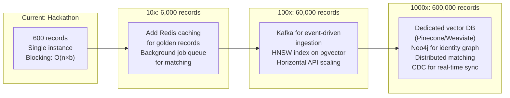

| Concern | Hackathon Approach | Production Approach |
|---|---|---|
| **Matching speed** | Blocking + sequential | Spark/Dask distributed matching |
| **Vector search** | pgvector (sufficient for 600 records) | Pinecone/Weaviate with HNSW |
| **Graph queries** | SQL edge table with recursive CTEs | Neo4j for complex traversals |
| **Data ingestion** | REST upload | Kafka topics per source system |
| **Caching** | Upstash Redis | Redis Cluster |
| **API scaling** | Single Render instance | Kubernetes HPA |
| **LLM** | Groq free tier (30 RPM) | Self-hosted Llama or vLLM |

---

## 14. Non-Functional Requirements

| Requirement | Target | Approach |
|---|---|---|
| **Response Time** | < 500ms for Customer 360 | Redis cache for golden records |
| **Matching Time** | < 10s for 600 records | Blocking reduces comparisons |
| **AI Explanation** | < 3s per explanation | Groq inference (~300 tok/s) |
| **Availability** | 99.5% (demo) | Vercel Edge + Render auto-restart |
| **Data Encryption** | At rest + in transit | Supabase encryption + TLS everywhere |
| **Token Expiry** | Access: 30 min, Refresh: 7 days | JWT with rotation |
| **Audit Retention** | All events, indefinite (demo) | Append-only audit_logs table |
| **Browser Support** | Chrome, Firefox, Edge (latest) | Next.js SSR + modern CSS |
| **Concurrent Users** | 10 (demo) | Connection pooling, async FastAPI |
